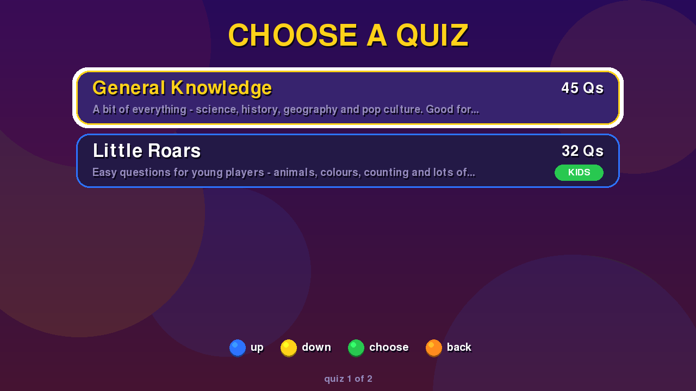
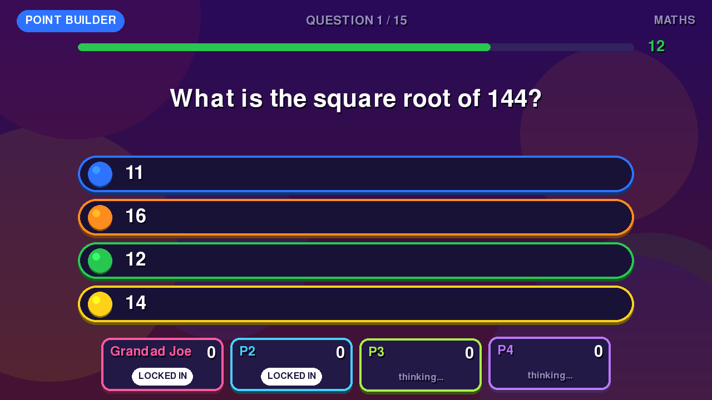
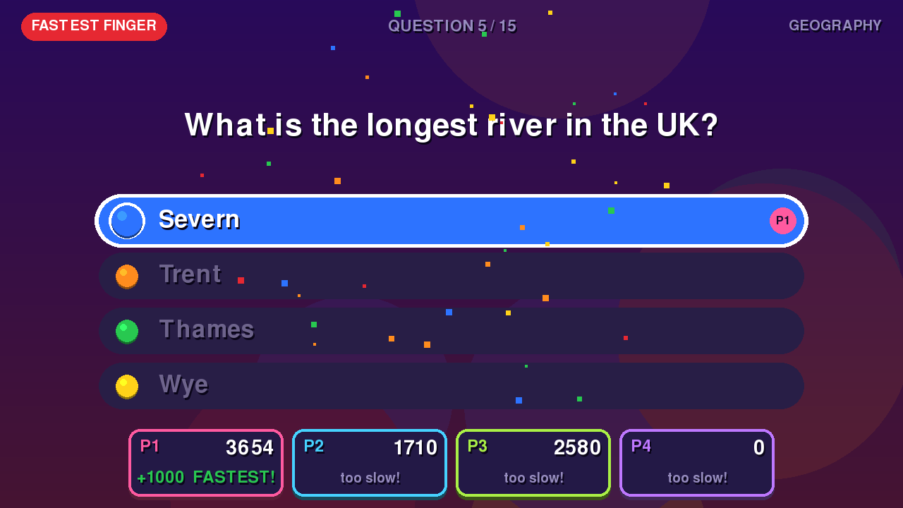
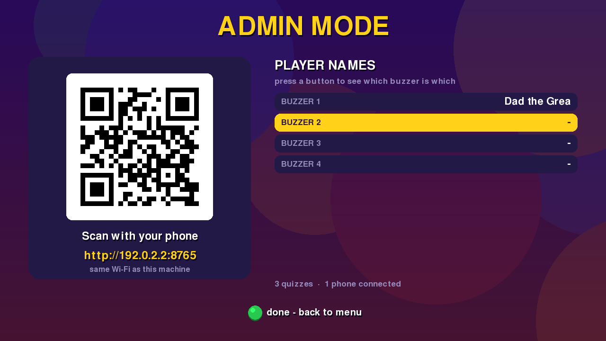
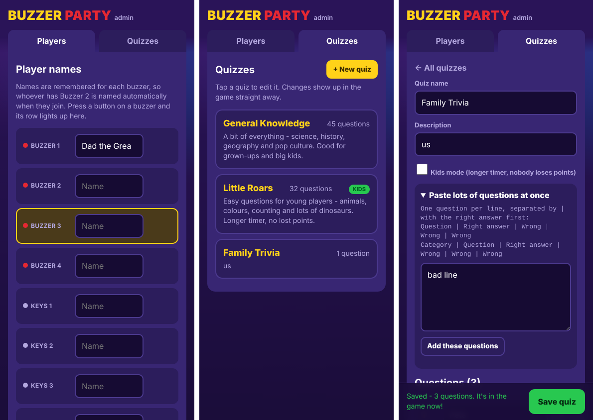

# Buzzer Party

A party quiz for PlayStation Buzz! buzzers on SteamOS (or any Linux PC). It supports up to 8 players.

- **Real buzzers.** Wired sets and the wireless dongle both work, and you can plug in two sets for 8 players. The red buzzer LEDs light up while a player still needs to answer, and flash when they get it right.
- **Gamepads work too.** That includes the Steam Deck's own controls. X = blue, B = orange, A = green, Y = yellow, LB/RB = red.
- **Keyboard for testing.** Player keys are `1-5`, `q-t`, `a-g` and `z-b`, in the order blue, orange, green, yellow, red. Enter = continue, Esc = back/quit, F11 = toggle fullscreen.
- **Admin mode.** Name players and build quizzes from your phone.

| | |
|---|---|
|  |  |
|  |  |



## Install (Desktop Mode)

```bash
git clone https://github.com/a-adz-1/buzzer-party.git ~/buzzer-party
cd ~/buzzer-party
bash install.sh
```

To update later, run `git pull` and then `bash install.sh` again. Your quizzes and names are kept.

The installer does three things:
1. Creates a local Python environment with pygame-ce and qrcode.
2. Writes the `run.sh` launcher.
3. Optionally installs the udev rule. You need the rule for the LEDs, and it also covers RPCS3 passthrough.

**To play in Game Mode:** in Steam, choose *Add a Non-Steam Game*, then pick **Buzzer Party**. The installer has already added it to your app menu.

## How to play

The game opens on a menu. Move with **BLUE/YELLOW** and pick with **GREEN**.

**Play**
1. **Choose a quiz.** Select one with GREEN. ORANGE goes back.
2. **Lobby.** Each player presses **RED** to join. ORANGE changes the game length, BLUE changes the quiz, and GREEN starts.
3. **Point Builder questions.** Answer with the coloured buttons. A right answer scores 200–1000, and faster answers score more.
4. **Fastest Finger.** Every 5th question is a Fastest Finger. The first right answer wins 1000. A wrong answer costs 250, except in kids quizzes.
5. **Scores.** A scoreboard appears every 5 questions. Press RED to skip it.

**Admin mode**

Admin mode starts a small web server. The screen shows its address and a QR code: scan it with any phone on the same Wi-Fi. From the web page you can:
- **Name players.** Names are remembered per buzzer, so whoever has Buzzer 2 shows up as "Mum" when they join. Press a button on a buzzer and its row lights up on both the TV and your phone, so you can see which buzzer is which.
- **Make and edit quizzes.** You can add, edit and delete questions, flag a quiz as kids mode, and paste in a whole list at once. For pasting, put one question per line:
  - `Question | Right | Wrong | Wrong | Wrong`
  - `Category | Question | Right | Wrong | Wrong | Wrong`

Press GREEN on the TV when you're done. The web server only runs while Admin mode is open, so it's not exposed the rest of the time. It has no password, so only use it on your home network.

Quizzes are saved as JSON in `questions/`, and names are saved in `names.json`. You can also edit these files by hand.

## Config

You can create `config.json` next to the game to override the defaults:

```json
{
  "question_time": 15,
  "kids_question_time": 25,
  "fastest_finger_every": 5,
  "web_port": 8080,
  "buzz_button_order": ["red", "yellow", "green", "orange", "blue"]
}
```

If pressing one colour registers as another, watch the *last press* line at the bottom of the menu. Then reorder `buzz_button_order` to match your buzzers. Some third-party sets differ from the official ones.

## Troubleshooting

- **"No Buzz buzzers detected".** Run `lsusb | grep -i 054c`. If your set shows a different ID, add it to the udev rule. The game also treats any 20-button, no-axis controller as a Buzz set.
- **"LEDs off".** The udev rule isn't installed. Rerun `install.sh`, or copy the rules file to `/etc/udev/rules.d/` yourself, then replug the buzzers.
